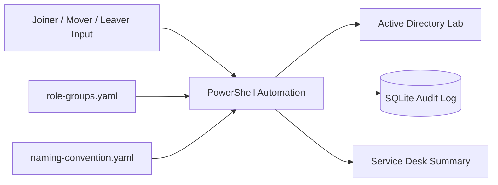

# Joiner–Mover–Leaver Identity Automation

> **Status: In Development**

A PowerShell-based identity lifecycle automation project for Active Directory that handles employee onboarding, role changes and offboarding with role-based access, dry-run safety, idempotent execution and full audit logging.

## Problem

Manual identity lifecycle processes can create inconsistent access, slow onboarding, stale permissions after job changes, incomplete offboarding and weak audit trails.

This project is designed to automate those workflows while keeping access decisions predictable and reviewable. User entitlements are derived from role configuration rather than being manually selected inside the scripts.

## Target Architecture



## Core Design Principles

### Role-based access

Access is derived from a user's role. Group membership is stored in configuration rather than hard-coded into each workflow.

### Dry-run by default

Potentially destructive operations should be previewable before execution. The design supports `-WhatIf` semantics and an explicit execution path so administrators do not run identity changes blindly.

### Idempotency

Running the same operation more than once should not create duplicate accounts or repeatedly apply the same changes.

### Full auditability

Each workflow should record what changed, who or what initiated it, the previous value, the new value, success or failure and whether the run was a dry-run.

## Technology Stack

- **PowerShell** — identity lifecycle automation
- **Active Directory Domain Services** — lab identity platform
- **YAML** — role and naming configuration
- **SQLite** — local audit log for the lab implementation
- **Pester** — automated PowerShell tests
- **PSScriptAnalyzer** — PowerShell linting/static analysis
- **GitHub Actions** — CI for lint and tests

## Workflows

### Joiner

The joiner workflow is intended to:

- read a new-starter record
- generate a username from the configured naming convention
- handle naming collisions such as `j.smith` → `j.smith2`
- create the account in the role's configured OU
- assign security groups from role mapping
- generate an initial password
- require password change at first logon
- create the home directory where applicable
- write an audit record
- output a service-desk-friendly summary

### Mover

The mover workflow is intentionally designed to do more than add access.

It should:

- load the user's current group memberships
- load the target role's required memberships
- calculate the difference
- remove access that the new role no longer grants
- add newly required access
- move the user to the correct OU
- log before and after state

Removing stale access after a role change is a key security requirement in this project.

### Leaver

The leaver workflow is intended to:

- disable the account
- reset the password to a random value
- revoke applicable sessions
- record existing group memberships before removal
- remove non-essential group memberships
- move the object to a disabled-users OU
- stamp the account with the leave date and ticket reference
- release associated licence state where implemented
- write a complete audit record

## Role Mapping Example

```yaml
roles:
  finance-analyst:
    groups:
      - GG_Finance_Users
      - GG_SAP_ReadOnly
      - GG_VPN_Standard
    ou: "OU=Finance,OU=Users,DC=lab,DC=local"
    licence: E3

  it-support:
    groups:
      - GG_IT_Staff
      - GG_Helpdesk_Admins
      - GG_VPN_Privileged
    ou: "OU=IT,OU=Users,DC=lab,DC=local"
    licence: E5
```

The principle is simple: access should be derived from configuration and role, not copied manually from another user.

## Planned Repository Structure

```text
jml-identity-automation/
├── src/
│   ├── Invoke-Joiner.ps1
│   ├── Invoke-Mover.ps1
│   ├── Invoke-Leaver.ps1
│   └── modules/
│       ├── AuditLog.psm1
│       ├── RoleMapping.psm1
│       └── Naming.psm1
├── config/
│   ├── role-groups.yaml
│   └── naming-convention.yaml
├── data/
│   └── sample-joiners.csv
├── tests/
├── .github/workflows/
└── README.md
```

## Build Roadmap

- [ ] Implement `Naming.psm1` with collision handling
- [ ] Add Pester tests for username generation
- [ ] Implement `RoleMapping.psm1` and YAML validation
- [ ] Implement `AuditLog.psm1` with SQLite persistence
- [ ] Build Joiner in dry-run mode
- [ ] Enable Joiner execution against the AD lab
- [ ] Build Leaver with idempotent behaviour
- [ ] Build Mover with entitlement-diff logic
- [ ] Add bulk CSV processing
- [ ] Add PSScriptAnalyzer and Pester to GitHub Actions
- [ ] Document worked examples and screenshots

## Safety Controls

### Dry-run support

Each destructive workflow should support previewing changes before execution.

### Idempotent behaviour

Examples:

- re-running the same joiner should not create a duplicate account
- re-running a leaver for an already-disabled account should result in a safe no-op

### Audit logging

The audit store is intended to record:

- timestamp
- operator
- operation
- target user
- attribute or entitlement changed
- before value
- after value
- success or failure
- dry-run flag

### Bulk-operation protection

Bulk destructive operations should require confirmation, with an explicit override such as `-Force` only where automation requires it.

## Tests That Matter

The test suite should verify real safety and lifecycle behaviour.

- username collisions produce a unique suffix rather than failing
- mover removes groups not present in the target role
- unchanged groups remain untouched
- leaver on an already-disabled account is a no-op
- dry-run changes nothing in AD but still records an audit event
- unknown roles fail before making any directory changes
- invalid configuration fails loudly and predictably

## Lab Environment

The project is intended to be developed against a dedicated lab environment using:

- Windows Server 2022 evaluation VM
- Active Directory Domain Services
- dedicated synthetic organisational units
- synthetic users, departments and group names

No production employer data, real employee identities or proprietary directory information should be committed to this repository.

## Security Considerations

A production identity automation service would require controls beyond this lab implementation, including:

- least-privilege service accounts
- secure credential and secret storage
- approval workflows for sensitive access
- privileged access management
- signed or controlled script deployment
- protected audit logs
- role-mapping governance
- rollback/recovery procedures
- ticketing and change-management integration
- monitoring for unauthorised configuration changes

See [`SECURITY.md`](SECURITY.md) for repository-specific guidance.

## Current Limitations

This repository is an active engineering project, not a production IAM platform. The initial implementation is deliberately scoped to a lab Active Directory environment and uses local configuration and SQLite for transparency and ease of demonstration.

Microsoft 365 / Entra ID licensing and session-revocation integrations may be represented as later extensions rather than assumed to be available in the initial lab.

## What This Project Demonstrates

- PowerShell automation
- Active Directory administration
- identity and access management concepts
- role-based access control
- joiner–mover–leaver lifecycle design
- safe destructive automation
- idempotent scripting
- audit logging
- configuration-driven engineering
- automated testing with Pester
- enterprise IT problem solving

## Interview Topics

The finished project is designed to support discussion around:

- What happens if a joiner process fails halfway through?
- How can privilege escalation through role mapping be prevented?
- Why derive groups from role instead of copying another user's access?
- How should a user with multiple roles be handled?
- What is the rollback plan after an incorrect mover operation?
- How should audit logs be protected from tampering?
- How would this design scale beyond one Active Directory environment?

## Future Improvements

Potential extensions include:

- Microsoft Entra ID / Microsoft Graph integration
- Microsoft 365 licence automation
- ServiceNow or Jira ticket integration
- approval workflows
- privileged access management integration
- automatic rollback snapshots
- cloud identity support
- reconciliation jobs that detect access drift
- richer reporting for joiner/mover/leaver metrics

## Development Approach

This project is being built incrementally. Core modules, tests and lifecycle workflows should be committed in focused steps so the repository history reflects genuine engineering progress.
